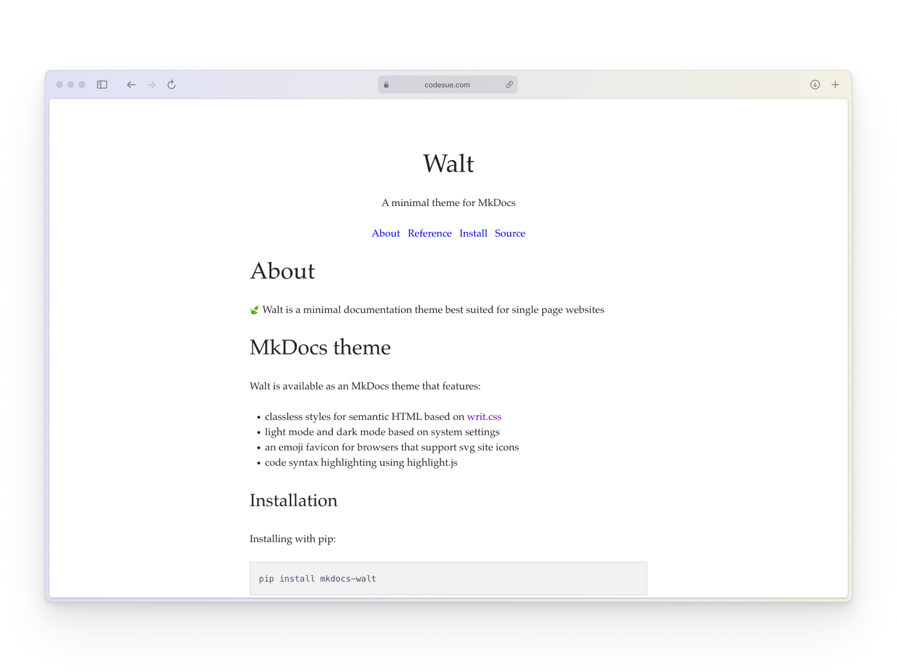

# walt

[![License][license_badge]][license_link]
[![PyPI][pypi_badge]][pypi_link]
[![GitHub][github_badge]][github_link]
[![Docs][docs_badge]][docs_link]

Walt is a minimal documentation theme based on [writ.css](https://writ.cmcenroe.me).
It features classless styles for semantic HTML and supports light and dark mode
based on system settings.

<picture>
  <source media="(prefers-color-scheme: dark)" srcset="assets/images/mkdocs-walt-dark.png" />
  
</picture>

## MkDocs theme

Walt is available as an MkDocs theme that features:

- classless styles for semantic HTML based on [writ.css](https://writ.cmcenroe.me)
- light mode and dark mode based on system settings
- an emoji favicon for browsers that support svg site icons
- code syntax highlighting using highlight.js

You can install it from PyPI using:

```sh
pip install mkdocs-walt
```

See the [`mkdocs-walt`](https://github.com/codesue/walt/blob/main/mkdocs-walt)
directory to learn how to install and use Walt in your MkDocs projects.

### Developing mkdocs-walt

#### Installing from source

```sh
git clone https://github.com/codesue/walt.git
cd walt/mkdocs-walt
pip install -e .
```

#### Running the example

```
cd ../examples/mkdocs  # if your current working directory is walt/mkdocs-walt
mkdocs serve
```

#### Building and distributing the package

1. Install the necessary packages:

```sh
pip install "clementine[rind]"
```

2. With `walt/mkdocs-walt` as your working directory, build the package and verify the build:

```sh
python -m build
twine check dist/*
```

3. Upload the package to TestPyPI:

```sh
twine upload -r testpypi dist/*
```

Install the package from TestPYPI in a clean virtual environment and confirm
that the example runs as expected:

```sh
pip install -i https://test.pypi.org/simple/ mkdocs-walt
```

4. Upload the package to PyPI:

```sh
twine upload dist/*
```

## License

Copyright &copy; 2023 [Suzen Fylke](https://suzenfylke.com). Distributed under the MIT License.

## Acknowledgements

Walt uses [writ.css](https://github.com/programble/writ/tree/master) for styles
and examples use [writ's reference html page](https://github.com/programble/writ/blob/master/reference.html).

Walt also uses [Catppuccin](https://github.com/catppuccin/catppuccin) for code
block syntax highlighting and dark mode color palettes.

[license_badge]: https://img.shields.io/github/license/codesue/walt?colorA=363a4f&colorB=b7bdf8&style=flat
[license_link]: https://github.com/codesue/walt/tree/main/LICENSE

[pypi_badge]: https://img.shields.io/pypi/v/mkdocs-walt?colorA=363a4f&colorB=b7bdf8&style=flat
[pypi_link]: https://pypi.org/project/mkdocs-walt

[github_badge]: https://img.shields.io/github/stars/codesue/walt?colorA=363a4f&colorB=b7bdf8&style=flat
[github_link]: https://github.com/codesue/walt

[docs_badge]: https://img.shields.io/github/actions/workflow/status/codesue/walt/publish-docs.yml?label=docs&colorA=363a4f&colorB=b7bdf8&style=flat
[docs_link]: https://github.com/codesue/walt/actions/workflows/publish-docs.yml
